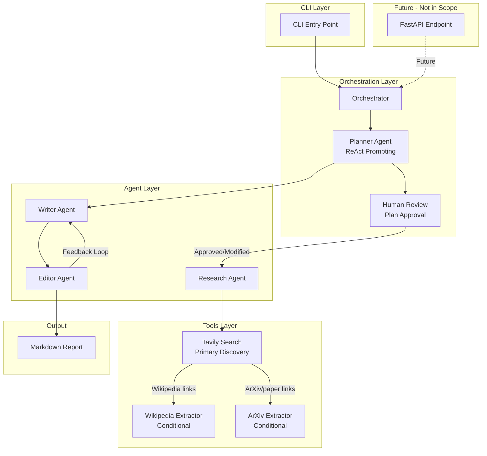
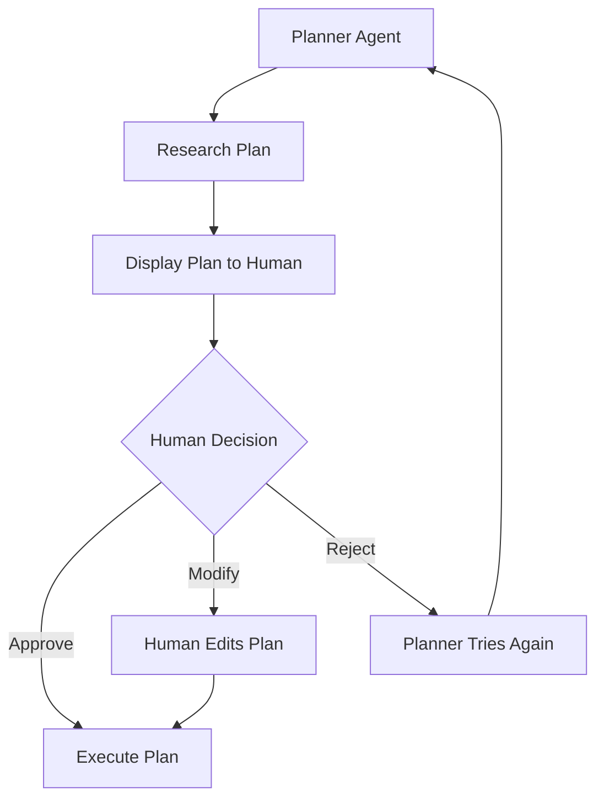
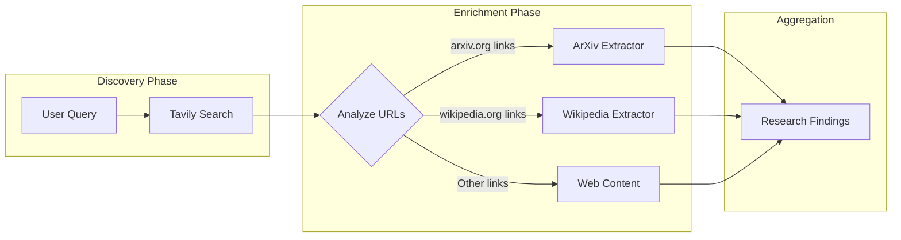
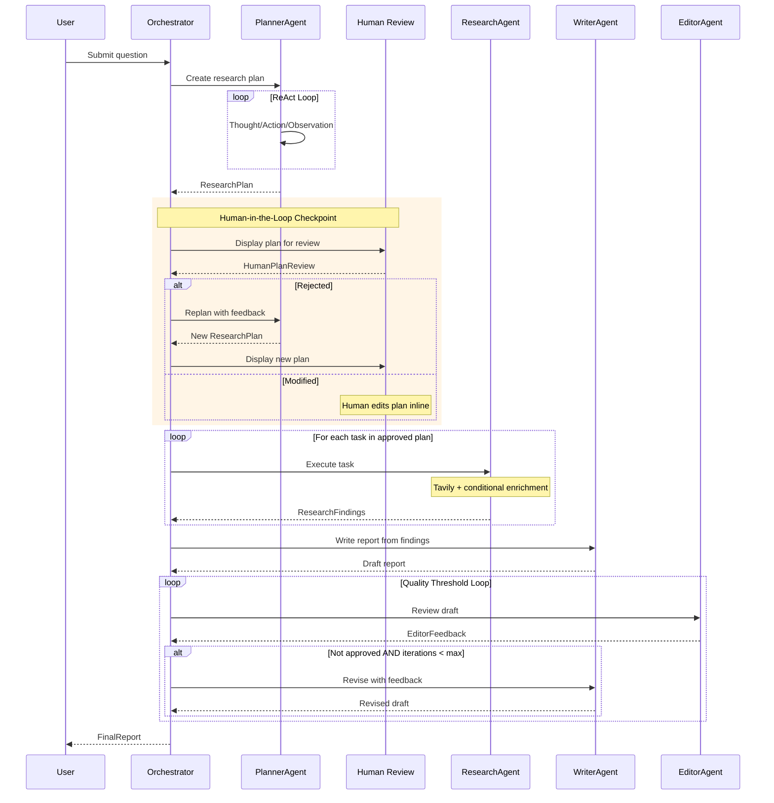

# Research Agent

A production-grade reflective research agent that creates comprehensive markdown reports using multi-agent orchestration.

## Features

- **Multi-Agent Architecture**: Specialized agents for planning, research, writing, and editing
- **ReAct Prompting**: Planner uses Reasoning + Acting pattern for thoughtful research plans
- **Tavily-First Search**: Primary web search with conditional ArXiv/Wikipedia enrichment
- **Human-in-the-Loop**: Plan approval checkpoint before research execution
- **Reflective Writing**: Quality-threshold loop between writer and editor agents
- **Rich CLI**: Beautiful terminal interface with progress display

## Architecture

### High-Level Architecture



### Human-in-the-Loop: Plan Approval



### Link-Based Enrichment Flow



### Complete Workflow Sequence



## Project Structure

```
research_agent/
├── src/
│   ├── agents/           # PydanticAI-based agents
│   │   ├── base.py       # Base agent abstraction
│   │   ├── planner.py    # ReAct research planner
│   │   ├── researcher.py # Tool-using researcher
│   │   ├── writer.py     # Report writer
│   │   └── editor.py     # Quality reviewer
│   ├── tools/            # Research tools
│   │   ├── tavily.py     # Web search (primary)
│   │   ├── arxiv.py      # Paper extraction
│   │   ├── wikipedia.py  # Article extraction
│   │   └── link_analyzer.py
│   ├── models/           # Pydantic models
│   ├── prompts/          # Agent prompts
│   ├── hitl/             # Human-in-the-loop
│   ├── cli/              # CLI entry point
│   ├── utils/            # Config & logging
│   └── orchestrator.py   # Workflow coordinator
├── tests/
├── main.py
├── pyproject.toml
└── .env.example
```

## Installation

1. Clone the repository:
```bash
git clone <repository-url>
cd research_agent
```

2. Install dependencies with uv:
```bash
uv sync
```

3. Set up environment variables:
```bash
cp .env.example .env
# Edit .env with your API keys
```

## Configuration

Set the following environment variables in `.env`:

| Variable | Required | Default | Description |
|----------|----------|---------|-------------|
| `OPENAI_API_KEY` | Yes | - | OpenAI API key |
| `TAVILY_API_KEY` | Yes | - | Tavily API key |
| `MODEL_NAME` | No | `gpt-4o` | OpenAI model to use |
| `MAX_REFLECTION_ITERATIONS` | No | `3` | Max writer/editor loops |
| `APPROVAL_THRESHOLD` | No | `7` | Score (1-10) for auto-approval |
| `LOG_LEVEL` | No | `INFO` | Logging level |

## Usage

### CLI

Run the research agent:

```bash
uv run python main.py
```

Or use the installed script:

```bash
uv run research-agent
```

### Programmatic

```python
import asyncio
from src import Orchestrator
from src.utils.config import get_settings

async def main():
    settings = get_settings()
    orchestrator = Orchestrator(settings)
    
    report = await orchestrator.run(
        "What are the latest advances in transformer architectures?"
    )
    
    print(report.content)

asyncio.run(main())
```

## Workflow

1. **Planning Phase**
   - User submits a research question
   - Planner Agent creates a research plan using ReAct
   - Human reviews and approves/modifies/rejects the plan

2. **Research Phase**
   - Researcher executes each task using Tavily
   - ArXiv links are enriched with paper metadata
   - Wikipedia links are enriched with article content

3. **Writing Phase**
   - Writer creates a markdown report from findings
   - Editor reviews against quality criteria
   - Loop continues until approved or max iterations

4. **Output**
   - Final markdown report with sources
   - Option to save to file

## Development

### Running Tests

```bash
uv run pytest
```

### Type Checking

```bash
uv run mypy src
```

## Future Enhancements

- [ ] State persistence for long-running processes
- [ ] FastAPI endpoint for web UI
- [ ] Additional HITL checkpoints
- [ ] Caching layer for tool results
- [ ] Rate limiting and retry logic

## License

MIT
